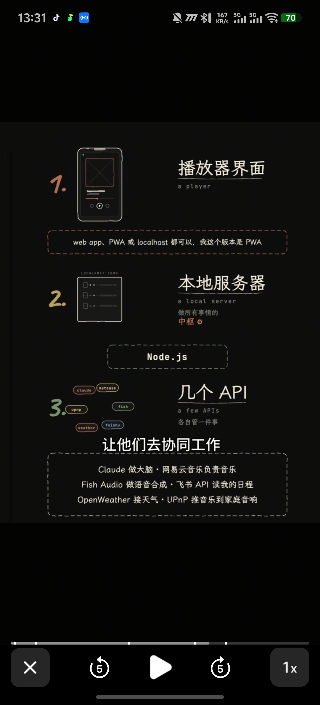

# GPT Neural Radio · 深夜 AI 电台

一个与 GPT-5.5 对话的个人情绪电台。你说出当下的心情，AI DJ **anjiu** 为你选曲、配音、生成过渡文案，并从网易云拉取真实的 mp3 播放。界面取自 *Her* / *Blade Runner 2049* 的未来情绪信号美学——暗底、微光、波形呼吸、核心球脉动。



## 特性

- **对话式电台**：自然语言输入心情 / 频率，AI 返回播报文案 + 5 首推荐曲单
- **真实播放**：基于网易云移动端公开 API + weapi 加密 fallback；登录后解锁 VIP
- **封面 / 歌词 / 进度**：高清专辑封面、LRC 同步滚动、可拖拽进度条
- **AI 口播（可选）**：Fish Audio TTS 把 DJ 文案合成语音，缓存本地复用
- **自动用户画像**：根据播放、点歌、聊天反馈、天气和时间段自动更新本地画像，不填表也能逐步学习口味
- **实时推送**：WebSocket 广播新队列，多端同步
- **情绪调度**：早、午、晚、睡前等时点自动触发一次新规划（可关）
- **安全默认**：所有外部 HTTP 请求都带超时，单首失败不影响整体

## 目录结构

```
AI电台/
├── backend/                  服务端
│   ├── server.js             入口：装配 express + ws
│   ├── routes.js             REST 路由
│   ├── config.js             集中配置（所有 env / 路径 / 常量）
│   ├── lib/
│   │   └── http.js           通用 request / requestJson / requestStream
│   ├── services/             外部 API 封装
│   │   ├── openai.js         GPT-5.5 对话
│   │   ├── ncm.js            网易云搜歌 / 播放地址 / 歌词 / 详情
│   │   ├── weapi.js          weapi 加密（VIP fallback）
│   │   ├── tts.js            Fish Audio / 有道 TTS
│   │   └── weather.js        彩云天气 / OpenWeather
│   └── core/                 业务核心
│       ├── context.js        system prompt 组装
│       ├── intent.js         意图路由（直接搜歌 vs AI 规划）
│       ├── queue.js          resolveQueue：并行拿 url / cover / lyric
│       ├── playback.js       播放状态 + WS 广播中心
│       ├── scheduler.js      定时触发
│       └── state.js          lowdb 持久化
│
├── frontend/                 前端（纯静态，无构建）
│   ├── index.html            页面骨架
│   ├── manifest.json         PWA 清单
│   ├── sw.js                 Service Worker（自毁版，清旧缓存）
│   ├── css/app.css           设计令牌 + 语义化样式
│   └── js/
│       ├── app.js            入口装配
│       ├── config.js         前端常量
│       ├── api.js            fetch + ws 封装
│       ├── chat.js           对话流
│       ├── queue.js          右侧歌单
│       ├── player.js         播放器
│       ├── lyrics.js         LRC 解析 / 同步
│       └── visuals.js        粒子 / 波形 / 核心球
│
├── prompts/                  AI 提示词
│   └── persona.md            anjiu 人格
├── user/                     个人画像（AI 读的上下文）
│   ├── profile.json          结构化用户画像（手动字段 + 自动学习层）
│   ├── taste.md              音乐口味
│   ├── routines.md           作息规律
│   └── mood-rules.md         情绪规则
│
├── cache/                    TTS mp3 缓存（自动生成）
├── state.json                播放历史 / 对话消息（自动生成）
├── .env                      运行时配置（不提交）
├── .env.example              配置模板
└── package.json
```

## 前置要求

- **Node.js ≥ 20.6**（用到 `--env-file` 原生支持）
- 一个 OpenAI API key（官方或 OpenAI 兼容代理都行）
- 可选：网易云黑胶账号 cookie（解锁 VIP），TTS key，彩云天气 key

## 快速开始

```bash
# 1. 安装依赖
npm install

# 2. 配置
cp .env.example .env
# 用编辑器打开 .env，至少填 OPENAI_API_KEY

# 3. 启动
npm start
# → GPT Neural Radio running at http://localhost:8080
```

开发模式（文件改动自动重启）：`npm run dev`。

打开 `http://localhost:8080`，在输入框说"帮我放点安静的"或直接 `播放 陶喆 爱我还是他`。

## 配置

所有配置集中在 **`.env`**，业务代码只通过 `backend/config.js` 读取。完整字段见 `.env.example`，这里列最关键的：

| 字段 | 必填 | 说明 |
|---|---|---|
| `PORT` | 否 | 默认 8080。**避开 Chrome 不安全端口**：6000、6665–6669 等 |
| `OPENAI_API_KEY` | **是** | OpenAI API key |
| `OPENAI_API_URL` | 否 | OpenAI 兼容接口地址；官方默认 `https://api.openai.com` |
| `OPENAI_MODEL` | 否 | 默认 `gpt-5.5`；第三方代理如果给了模型别名，填它要求的名字 |
| `OPENAI_MAX_TOKENS` | 否 | 默认 `1024` |
| `OPENAI_TIMEOUT_MS` | 否 | 默认 `30000` |
| `OPENAI_REASONING_EFFORT` | 否 | 默认 `low`，可设 `high` |
| `NCM_MUSIC_U` | 否 | 网易云登录 cookie，**解锁 VIP** |
| `NCM_CSRF` | 否 | 配合 `NCM_MUSIC_U` 一起使用 |
| `NCM_BITRATE` | 否 | 默认 `hires`，优先高解析度无损 Hi-Res |
| `NCM_BITRATE_FALLBACKS` | 否 | 默认 `jyeffect,exhigh,standard`，Hi-Res 不可用时先退到高清臻音 |
| `NCM_OPENAPI_APP_ID` / `NCM_OPENAPI_ACCESS_TOKEN` | 否 | 网易云 IoT OpenAPI 凭据；未配置时榜单列表退到公开接口 |
| `TTS_PROVIDER` | 否 | `youdao` / `fish` / `auto`，有配置则启用 AI 口播 |
| `WEB_SEARCH_API_KEY` | 否 | 智谱 Web Search key，用于实时榜单和当前歌曲背景检索 |
| `WEB_SEARCH_ENGINE` | 否 | 默认 `search_std`，对应智谱 search-std 资源包 |
| `CAIYUN_APP_KEY` | 否 | 彩云天气 App Key，有则把天气传给 AI 当上下文 |
| `CAIYUN_APP_SECRET` | 否 | 彩云天气 App Secret，推荐配置，用于签名鉴权 |
| `WEATHER_CITY` | 否 | 默认 `合肥` |
| `WEATHER_LONGITUDE` / `WEATHER_LATITUDE` | 否 | 天气坐标，默认合肥 |
| `SCHEDULER_ENABLED` | 否 | `false` 可关闭定时播报 |

### 拿到 `NCM_MUSIC_U`

1. Chrome 打开 `https://music.163.com` 并登录（你的黑胶账号）
2. F12 → Application → Cookies → `https://music.163.com`
3. 复制 `MUSIC_U` 的值到 `.env` 的 `NCM_MUSIC_U`；顺便复制 `__csrf` 到 `NCM_CSRF`
4. 重启服务

**安全**：`MUSIC_U` 等于你的登录态，相当于账号密码。`.env` 已在 `.gitignore`，**不要提交**。担心泄露时去网易云"账号安全 → 退出所有设备"即可作废。

## API 端点

| 方法 | 路径 | 说明 |
|---|---|---|
| POST | `/api/chat` | 发消息给 AI，返回 `{say, play, queue, ttsUrl}` |
| GET | `/api/now` | 当前播放 + 队列 |
| POST | `/api/play` | 按 `next` / `prev` / `index` 切歌并广播 |
| GET | `/api/next` | 兼容旧调用，切到下一首 |
| GET | `/api/search?q&limit` | 网易云搜歌 |
| GET | `/api/song/url?id` | 拿播放地址（VIP 自动 fallback weapi） |
| GET | `/api/toplists` | 获取云音乐榜单列表；支持 `category` / `q` 过滤 |
| GET | `/api/toplists/:id/tracks` | 获取某个榜单的歌曲列表 |
| POST | `/api/dj/preview` | 预生成尾段串场，用于下一首切换前先开口 |
| POST | `/api/dj/preview/mark` | 标记这段尾段串场已经实际播出 |
| GET | `/api/plan/today` / POST | 今日日程 get/set |
| GET | `/api/taste` | 最近播放 + 偏好快照 |
| GET/POST | `/api/profile` | 读取 / 保存结构化用户画像 |
| GET | `/api/profile/suggestion` | 根据最近播放生成待确认的画像建议 |
| WS | `/stream` | 新队列 / 切歌的实时推送 |

## 架构笔记

**前后端契约**：前端通过 `fetch('/api/chat', …)` 发起对话，后端返回结构化 JSON：
```json
{
  "say":    "DJ 文案，将被 TTS 朗读",
  "play":   ["歌名 - 艺人", "..."],
  "reason": "选曲理由（内部）",
  "segue":  "衔接语",
  "ttsUrl": "/tts/xxx.mp3",
  "queue":  [{ id, name, artist, cover, url, lyric, ... }],
  "currentIndex": 0,
  "nowPlaying": { "id": 1, "name": "..." }
}
```
服务端维护权威播放状态，前端只同步 `queue/currentIndex/nowPlaying` 并播放。WebSocket 用于主动推送（定时触发 / 多端同步）。

**为何要走音频代理**：网易云 CDN (`*.music.126.net`) 不返回 `Access-Control-Allow-Origin`，`<audio>` 直连时无法安全接入 `AudioContext` 做真实频谱分析。后端通过 `/api/song/stream` 同源代理音频后，前端就能把主播放器接进 `AnalyserNode`，同时保留 Range seek。

**为何不用网易云 OpenAPI**：官方开放平台的 device 公共参数是给 appId 绑定白名单的，个人入驻不开放 HTTP 直调（只能通过 OpenClaw 客户端的 ncm-cli skill）。所以走移动端公开 API 路径：`/api/search/get` + `/api/song/enhance/player/url/v1`；VIP 歌曲在未登录时返回 `code:-110`，带上 `MUSIC_U` cookie 就通了。

**调度器**：`backend/core/scheduler.js` 按 cron 表调用 `askRadioPlan` → `resolveQueue` → 广播，让电台在早 7 / 午 12 / 晚 22 等时点自动切换氛围。完全可关。

## FAQ

**Q: 启动时警告 `NCM_MUSIC_U not set`？**
不影响启动和免费歌曲。只是 VIP 歌的 URL 会是 null，前端会在那一行显示灰色"RESTRICTED"并跳过。

**Q: `[tts] stream timeout` 一直在刷？**
`.env` 里 `FISH_API_KEY` 还没填实值。要么把它清空（不配 = 跳过 TTS），要么填真实 key。

**Q: VIP 歌又不能播了？**
多半 cookie 过期。重新抓一次 `MUSIC_U` 替换即可。

**Q: Chrome 提示 `ERR_UNSAFE_PORT`？**
端口踩雷了。Chrome 把 6000 / 6665–6669 等标为不安全，改 `PORT=8080` 或 `8888`。

**Q: 改了代码浏览器看到的还是旧版？**
老 Service Worker 缓存没清掉。F12 → Application → Service Workers → Unregister，再 Cmd+Shift+R 硬刷一次。新版 `sw.js` 是自毁脚本，之后就不会再卡缓存。

**Q: 能跑在 https 上吗？**
能。前端 WS 协议已经自适应（`wsUrl()` 会根据 `location.protocol` 选 ws/wss）。上 https 的话在你自己的反代（nginx/caddy）终止 TLS 即可。
